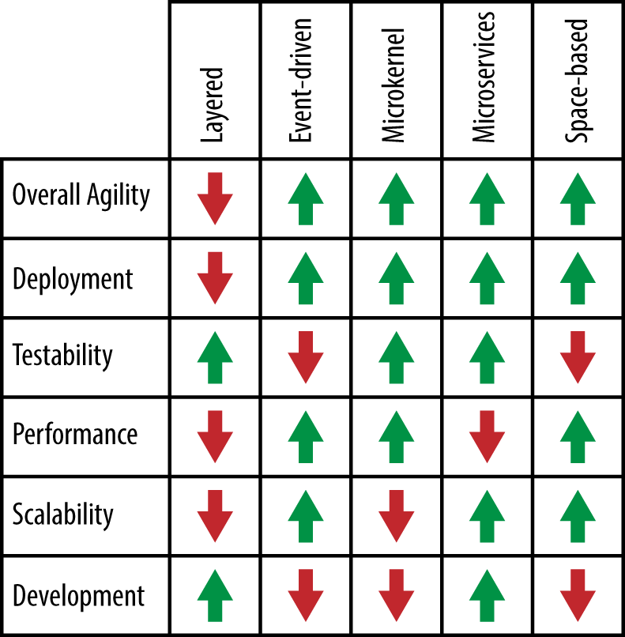

# Pattern Analysis Summary

Figure A-1 summarizes the pattern-analysis scoring for each of the architecture patterns described in this report. This summary will help you determine which pattern might be best for your situation. For example, if your primary architectural concern is scalability, you can look across this chart and see that the event-driven pattern, microservices pattern, and space-based pattern are probably good architecture pattern choices. Similarly, if you choose the layered architecture pattern for your application, you can refer to the chart to see that deployment, performance, and scalability might be risk areas in your architecture.  

While this chart will help guide you in choosing the right pattern, there is much more to consider when choosing an architecture pattern. You must analyze all aspects of your environment, including infrastructure support, developer skill set, project budget, project deadlines, and application size (to name a few). Choosing the right architecture pattern is critical, because once an architecture is in place, it is very hard (and expensive) to change.
