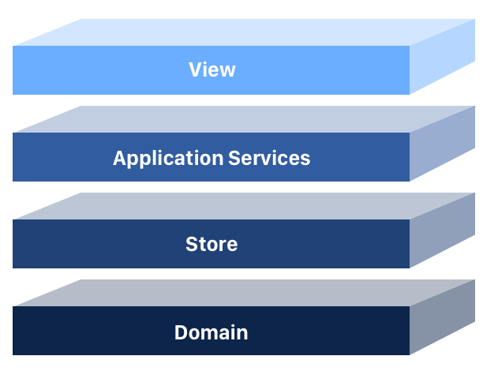
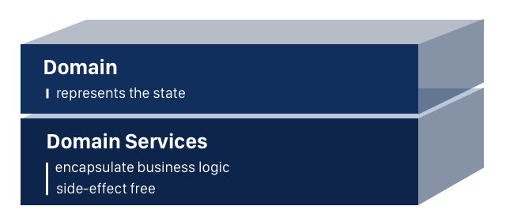
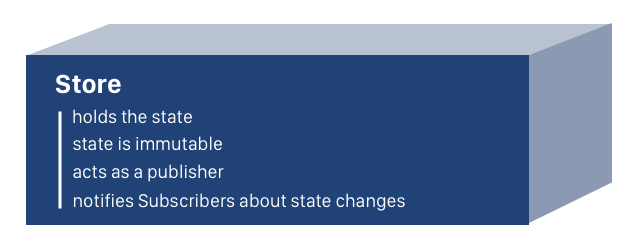
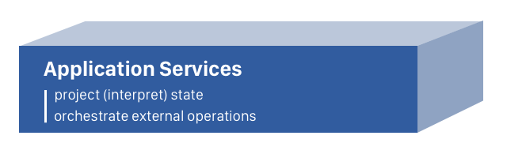
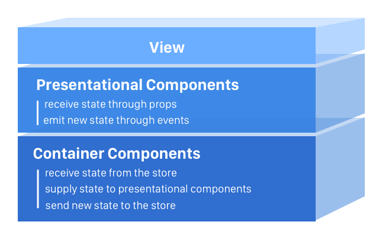

# The 4 Layers of Single Page Applications

Let’s architect a React application from the ground up, exploring the domain and its services, store, application services and the view.

Every successful project needs a clear architecture, which is understood by all team members.  
Imagine you’re new to the team. The technical leader presents the proposed architecture for the new application coming up on the roadmap:

## The state

The state represents every piece of data that changes in an application.

You visit an URL, that’s state, make an Ajax call to retrieve a list of movies, that’s state again, you persist info to local storage, ditto, state.

The state will consist of immutable objects.

Immutable architecture has many benefits, one being at the view level.

Here is a quote from React’s guide to optimizing performance:

>Immutability makes tracking changes cheap. A change will always result in a new object so we only need to check if the reference to the object has changed. [4]

## The domain layer
The domain describes the state and holds the business logic. It represents the core of our application and should be agnostic to the view layer. Angular, React, Vue, it shouldn’t matter, we should be able to use our domain regardless of the framework we choose.

Because we are dealing with immutable architecture, our domain layer will consist of entities and domain services.

Controversial in OOP, especially in large-scale applications, the anemic domain model is perfectly acceptable when working with immutable data.

Validations are very important in keeping our data consistent, especially at the domain level. We can compose our Validators service out of pure functions.

## The store layer

The data which results from creating and updating articles represents our application’s state.

We need a place to hold that data, the store being the perfect candidate for the job.

The ArticleStoreFactory implements the publish-subscribe pattern and exports the articleStore as a singleton.

The store holds the articles and performs the add, remove and update immutable operations on them.

>Keep in mind that the store only operates on articles. Only the articleService, can create or update them.

Interested parties can subscribe and unsubscribe to the articleStore.

The articleStore keeps a list in memory of all subscribers and notifies them of each change.

Our store implementation makes sense for demo purposes, allowing us to understand the concepts behind it. In real life, I recommend using a state management system like Redux, ngrx, MobX or at least observable data services.

Ok, right now we have the domain and store layers setup.

Let’s create two articles and two subscribers to the store and observe how the subscribers get notified of changes.

## Application services

This layer is useful for doing all kinds of operations which are adjacent to the state flow like Ajax calls to retrieve data from the server or state projections.

For whatever reason, a designer comes and demands all author names to be uppercase.

We know this request is kind of silly and we don’t want to pollute our model with it.

We create the ArticleUiService to handle this feature. The service will take a piece of state, the author’s name, and project it, returning the uppercase version of it to the caller.

## The view layer

Right now we have a fully working application, agnostic of any framework, ready to be put to life by React.

The view layer is composed of presentational and container components.

Presentational components are concerned with how things look while container components are concerned with how things work. For a detailed explanation check out Dan Abramov’s article.

Let’s build the App component, consisting of the ArticleFormContainer and ArticleListContainer.

Now let’s create the ArticleFormContainer. React, Angular, it does not matter, forms are complicated.

>Check out the Ramda library and how it’s methods enhance the declarative nature of our code.

The form takes user input and passes it to the articleService. The service creates an Article from that input and adds it to the ArticleStore for interested components to consume it. All this logic resides primarily in the submitForm method.

Notice that the ArticleFormContainer returns the actual form which the user sees, the presentational ArticleFormComponent. This component displays the data passed by the container and emits events like changeArticleTitle, changeArticleAuthor, and submitForm.

Now that we have a form to create articles, it’s time to list them. ArticleListContainer subscribes to the ArticleStore, gets all the articles and displays the ArticleListComponent.

The ArticleListComponent is a presentational component. It receives the articles through props and renders ArticleContainer components.

The ArticleContainer passes the article data to the presentational ArticleComponent. It also implements the likeArticle and removeArticle methods.

The likeArticle method updates the number of likes, by replacing the existing article inside the store with an updated copy.

The removeArticle method deletes the article from the store.

The ArticleContainer passes the article data to the ArticleComponent which displays it. It also informs the container component when the like or delete buttons are clicked, by executing the appropriate callbacks.

>Remember the crazy request that the author name should be uppercase?

The ArticleComponent uses the ArticleUiService from the application layer to project a piece of state from its original value (string with no rule for uppercase) to the desired one, uppercase string.
