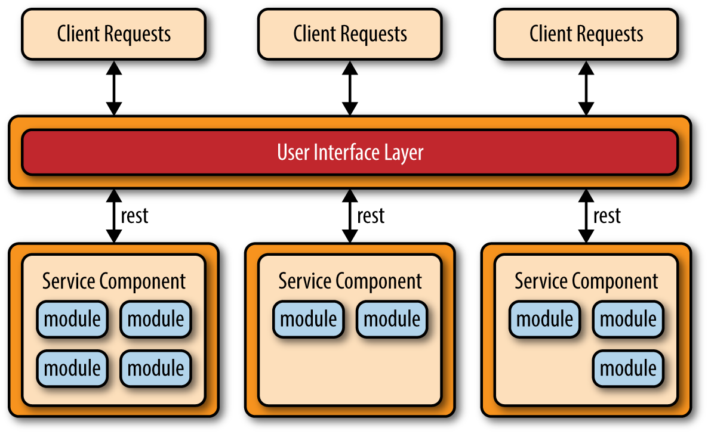
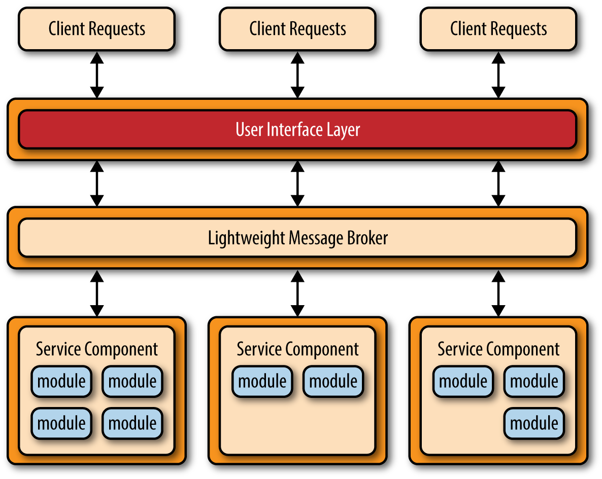

# Microservices Architecture Pattern

The microservices architecture pattern is quickly gaining ground in the industry as a viable alternative to monolithic applications and service-oriented architectures. Because this architecture pattern is still evolving, there’s a lot of confusion in the industry about what this pattern is all about and how it is implemented. This section of the report will provide you with the key concepts and foundational knowledge necessary to understand the benefits (and trade-offs) of this important architecture pattern and whether it is the right pattern for your application.  

## Pattern Description

Regardless of the topology or implementation style you chose, there are several common core concepts that apply to the general architecture pattern. The first of these concepts is the notion of separately deployed units. As illustrated in Figure 4-1, each component of the microservices architecture is deployed as a separate unit, allowing for easier deployment through an effective and streamlined delivery pipeline, increased scalability, and a high degree of application and component decoupling within your application.

Perhaps the most important concept to understand with this pattern is the notion of a service component. Rather than think about services within a microservices architecture, it is better to think about service components, which can vary in granularity from a single module to a large portion of the application. Service components contain one or more modules (e.g., Java classes) that represent either a single-purpose function (e.g., providing the weather for a specific city or town) or an independent portion of a large business application (e.g., stock trade placement or determining auto-insurance rates). Designing the right level of service component granularity is one of the biggest challenges within a microservices architecture. This challenge is discussed in more detail in the following service-component orchestration subsection.

Another key concept within the microservices architecture pattern is that it is a distributed architecture, meaning that all the components within the architecture are fully decoupled from one other and accessed through some sort of remote access protocol (e.g., JMS, AMQP, REST, SOAP, RMI, etc.). The distributed nature of this architecture pattern is how it achieves some of its superior scalability and deployment characteristics.

One of the exciting things about the microservices architecture is that it evolved from issues associated with other common architecture patterns, rather than being created as a solution waiting for a problem to occur. The microservices architecture style naturally evolved from two main sources: monolithic applications developed using the layered architecture pattern and distributed applications developed through the service-oriented architecture pattern.

The evolutionary path from monolithic applications to a microservices architecture style was prompted primarily through the development of continuous delivery, the notion of a continuous deployment pipeline from development to production which streamlines the deployment of applications. Monolithic applications typically consist of tightly coupled components that are part of a single deployable unit, making it cumbersome and difficult to change, test, and deploy the application (hence the rise of the common “monthly deployment” cycles typically found in most large IT shops). These factors commonly lead to brittle applications that break every time something new is deployed. The microservices architecture pattern addresses these issues by separating the application into multiple deployable units (service components) that can be individually developed, tested, and deployed independent of other service components.

The other evolutionary path that lead to the microservices architecture pattern is from issues found with applications implementing the service-oriented architecture pattern (SOA). While the SOA pattern is very powerful and offers unparalleled levels of abstraction, heterogeneous connectivity, service orchestration, and the promise of aligning business goals with IT capabilities, it is nevertheless complex, expensive, ubiquitous, difficult to understand and implement, and is usually overkill for most applications. The microservices architecture style addresses this complexity by simplifying the notion of a service, eliminating orchestration needs, and simplifying connectivity and access to service components.  

## Pattern Topologies

While there are literally dozens of ways to implement a microservices architecture pattern, three main topologies stand out as the most common and popular: the API REST-based topology, application REST-based topology, and the centralized messaging topology.

The API REST-based topology is useful for websites that expose small, self-contained individual services through some sort of API (application programming interface). This topology, which is illustrated in Figure 4-2, consists of very fine-grained service components (hence the name microservices) that contain one or two modules that perform specific business functions independent from the rest of the services. In this topology, these fine-grained service components are typically accessed using a REST-based interface implemented through a separately deployed web-based API layer. Examples of this topology include some of the common single-purpose cloud-based RESTful web services found by Yahoo, Google, and Amazon.

The application REST-based topology differs from the API REST-based approach in that client requests are received through traditional web-based or fat-client business application screens rather than through a simple API layer. As illustrated in Figure 4-3, the user-interface layer of the application is deployed as a separate web application that remotely accesses separately deployed service components (business functionality) through simple REST-based interfaces. The service components in this topology differ from those in the API-REST-based topology in that these service components tend to be larger, more coarse-grained, and represent a small portion of the overall business application rather than fine-grained, single-action services. This topology is common for small to medium-sized business applications that have a relatively low degree of complexity.

Another common approach within the microservices architecture pattern is the centralized messaging topology. This topology (illustrated in Figure 4-4) is similar to the previous application REST-based topology except that instead of using REST for remote access, this topology uses a lightweight centralized message broker (e.g., ActiveMQ, HornetQ, etc.). It is vitally important when looking at this topology not to confuse it with the service-oriented architecture pattern or consider it “SOA-Lite." The lightweight message broker found in this topology does not perform any orchestration, transformation, or complex routing; rather, it is just a lightweight transport to access remote service components.

The centralized messaging topology is typically found in larger business applications or applications requiring more sophisticated control over the transport layer between the user interface and the service components. The benefits of this topology over the simple REST-based topology discussed previously are advanced queuing mechanisms, asynchronous messaging, monitoring, error handling, and better overall load balancing and scalability. The single point of failure and architectural bottleneck issues usually associated with a centralized broker are addressed through broker clustering and broker federation (splitting a single broker instance into multiple broker instances to divide the message throughput load based on functional areas of the system).  

## Avoid Dependencies and Orchestration

One of the main challenges of the microservices architecture pattern is determining the correct level of granularity for the service components. If service components are too coarse-grained you may not realize the benefits that come with this architecture pattern (deployment, scalability, testability, and loose coupling). However, service components that are too fine-grained will lead to service orchestration requirements, which will quickly turn your lean microservices architecture into a heavyweight service-oriented architecture, complete with all the complexity, confusion, expense, and fluff typically found with SOA-based applications.

If you find you need to orchestrate your service components from within the user interface or API layer of the application, then chances are your service components are too fine-grained. Similarly, if you find you need to perform inter-service communication between service components to process a single request, chances are your service components are either too fine-grained or they are not partitioned correctly from a business functionality standpoint.

Inter-service communication, which could force undesired couplings between components, can be handled instead through a shared database. For example, if a service component handing Internet orders needs customer information, it can go to the database to retrieve the necessary data as opposed to invoking functionality within the customer-service component.

The shared database can handle information needs, but what about shared functionality? If a service component needs functionality contained within another service component or common to all service components, you can sometimes copy the shared functionality across service components (thereby violating the DRY principle: don’t repeat yourself). This is a fairly common practice in most business applications implementing the microservices architecture pattern, trading off the redundancy of repeating small portions of business logic for the sake of keeping service components independent and separating their deployment. Small utility classes might fall into this category of repeated code.

If you find that regardless of the level of service component granularity you still cannot avoid service-component orchestration, then it’s a good sign that this might not be the right architecture pattern for your application. Because of the distributed nature of this pattern, it is very difficult to maintain a single transactional unit of work across (and between) service components. Such a practice would require some sort of transaction compensation framework for rolling back transactions, which adds significant complexity to this relatively simple and elegant architecture pattern.     

## Considerations

The microservices architecture pattern solves many of the common issues found in both monolithic applications as well as service-oriented architectures. Since major application components are split up into smaller, separately deployed units, applications built using the microservices architecture pattern are generally more robust, provide better scalability, and can more easily support continuous delivery.

Another advantage of this pattern is that it provides the capability to do real-time production deployments, thereby significantly reducing the need for the traditional monthly or weekend “big bang” production deployments. Since change is generally isolated to specific service components, only the service components that change need to be deployed. If you only have a single instance of a service component, you can write specialized code in the user interface application to detect an active hot-deployment and redirect users to an error page or waiting page. Alternatively, you can swap multiple instances of a service component in and out during a real-time deployment, allowing for continuous availability during deployment cycles (something that is very difficult to do with the layered architecture pattern).  

One final consideration to take into account is that since the microservices architecture pattern is a distributed architecture, it shares some of the same complex issues found in the event-driven architecture pattern, including contract creation, maintenance, and government, remote system availability, and remote access authentication and authorization.
Pattern Analysis

The following table contains a rating and analysis of the common architecture characteristics for the microservices architecture pattern. The rating for each characteristic is based on the natural tendency for that characteristic as a capability based on a typical implementation of the pattern, as well as what the pattern is generally known for. For a side-by-side comparison of how this pattern relates to other patterns in this report, please refer to Appendix A at the end of this report.

### Overall agility
Rating: High  
Analysis: Overall agility is the ability to respond quickly to a constantly changing environment. Due to the notion of separately deployed units, change is generally isolated to individual service components, which allows for fast and easy deployment. Also, applications build using this pattern tend to be very loosely coupled, which also helps facilitate change.

### Ease of deployment
Rating: High  
Analysis: The deployment characteristics of the microservices pattern rate very high due to the fine-grained and independent nature of the remote services. Services are generally deployed as separate units of software, resulting in the ability to do “hot deployments” any time during the day or night. Overall deployment risk is also significantly reduced, in that failed deployments are able to be restored more quickly and only impact the operations on the service being deployed, resulting in continued operations for all other operations.

### Testability
Rating: High  
Analysis: Due to the separation and isolation of business functionality into independent applications, testing can be scoped, allowing for more targeted testing efforts. Regression testing for a particular service component is much easier and more feasible than regression testing for an entire monolithic application. Also, since the service components in this pattern are loosely coupled, there is much less of a chance from a development perspective of making a change that breaks another part of the application, easing the testing burden of having to test the entire application for one small change.

### Performance
Rating: Low  
Analysis: While you can create applications implemented from this pattern that perform very well, overall this pattern does not naturally lend itself to high-performance applications due to the distributed nature of the microservices architecture pattern.

### Scalability
Rating: High  
Analysis: Because the application is split into separately deployed units, each service component can be individually scaled, allowing for fine-tuned scaling of the application. For example, the admin area of a stock-trading application may not need to scale due to the low user volumes for that functionality, but the trade-placement service component may need to scale due to the high throughput needed by most trading applications for this functionality.

### Ease of development
Rating: High  
Analysis: Because functionality is isolated into separate and distinct service components, development becomes easier due to the smaller and isolated scope. There is much less chance a developer will make a change in one service component that would affect other service components, thereby reducing the coordination needed among developers or development teams.
